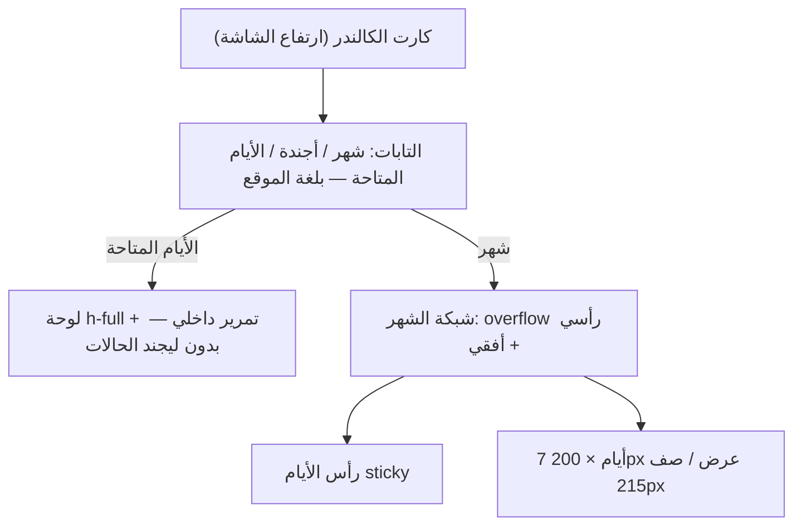

# إصلاحات الكالندر: اللوحة، الليجند، اللغة، والتكبير

## التعديلات

### 1) تاب «الأيام المتاحة»: تمرير اللوحة + إخفاء الليجند — `components/CalendarView.tsx`

- **سبب عدم النزول لتحت:** جذر اللوحة `min-h-[900px] overflow-y-auto` — الـ min-height بيكبر اللوحة عن المساحة المتاحة والكارت الأب `overflow-hidden` بيقصها من غير أي scroll. الحل: تحويلها إلى `h-full min-h-0 overflow-y-auto` — اللوحة تتقيد بالمساحة المتاحة وتمرر محتواها داخليًا.
- سطر ملخص الأيام (المتاح/غير المتاح) يبقى **sticky** أعلى اللوحة أثناء التمرير.
- **علامات الحالة الثلاثة (Confirmed / Pending / Cancelled):** الليجند السفلي (سطور 418–432) بيظهر في التلات تابات — يُلف بـ `{view !== 'availability' && (...)}` فيظهر فقط في شهر/أجندة ويختفي من الأيام المتاحة.

### 2) لغة التابات الثلاثة تتبع لغة الموقع — `components/CalendarView.tsx` (CustomToolbar)

| الموقع | التابات |
|---|---|
| عربي | شهر / أجندة / الأيام المتاحة |
| إنجليزي | Month / Agenda / Availability |

- Month وAgenda حرفيًا ثابتين بالإنجليزي حاليًا — يُستبدلا بـ `language === 'ar' ? 'شهر' : 'Month'` و`language === 'ar' ? 'أجندة' : 'Agenda'` (تاب الأيام المتاحة بيتغير أصلًا).

### 3) الشهر: أطول وأعرض وأيام أكبر + تمرير يمين/شمال — `index.html` (كتلة CSS)

- `.rbc-month-row`: `min-height: 175px → 215px` — اليوم أطول لتحت بشكل واضح.
- `.rbc-month-view`: `overflow-y: auto → overflow: auto` — تمرير رأسي + أفقي.
- جديد: `.rbc-month-header, .rbc-month-row { min-width: 1400px }` — كل يوم ≈ 200px عرض؛ على الشاشات الأصغر يظهر تمرير يمين/شمال، وعلى الشاشات الواسعة يتوزع بالكامل. رأس الأيام sticky أفقيًا ورأسيًا ومتزامن مع الصفوف.
- `.rbc-event { font-size: 14px }` و `.rbc-date-cell { font-size: 1.1rem }` — الأسماء والأرقام أوضح في الخلايا الأكبر.

## خطوات → تحقق

| الخطوة | الملف | التحقق |
|---|---|---|
| تمرير اللوحة + sticky ملخص + إخفاء الليجند | `CalendarView.tsx` | تاب الأيام المتاحة ينزل لتحت، وبدون علامات الحالة |
| ترجمة التابات | `CalendarView.tsx` | الموقع العربي: شهر/أجندة/الأيام المتاحة، والإنجليزي: Month/Agenda/Availability |
| صفوف 215px + تمرير أفقي + خطوط أكبر | `index.html` | اليوم كبير ويتحرك يمين/شمال ورأسيًا |
| البناء | — | `npx vite build` نجاح بدون أخطاء |